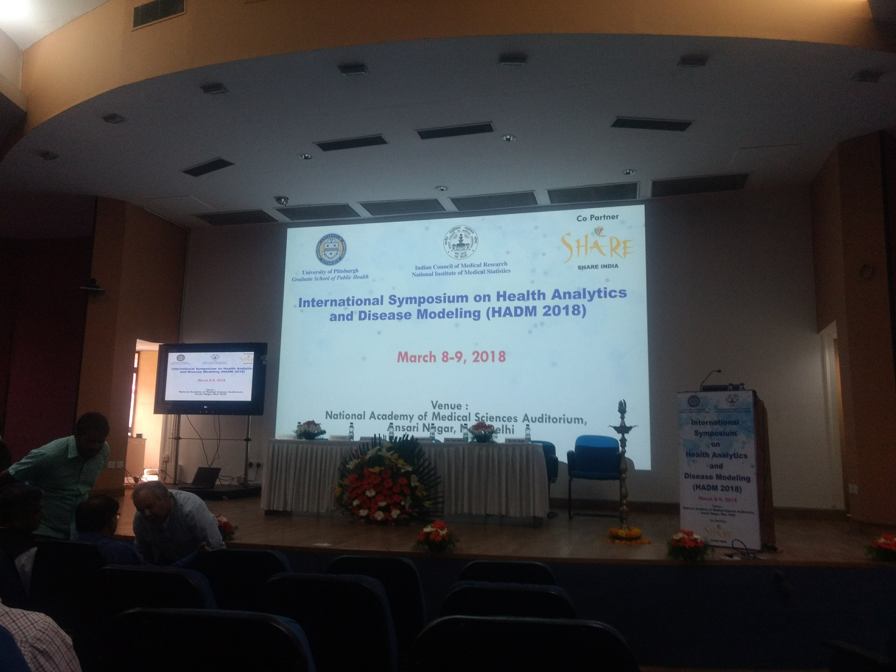
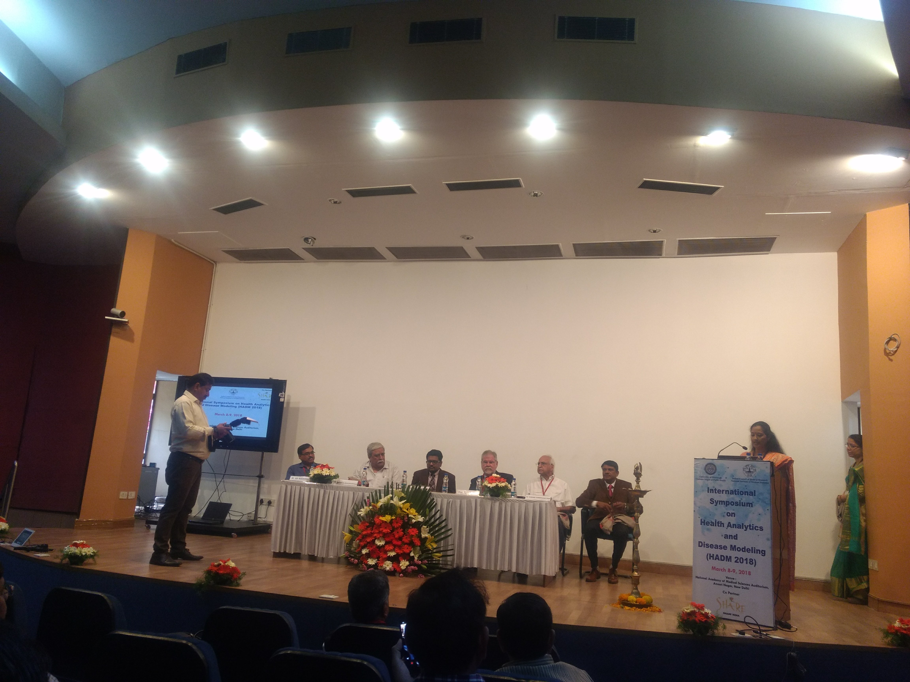
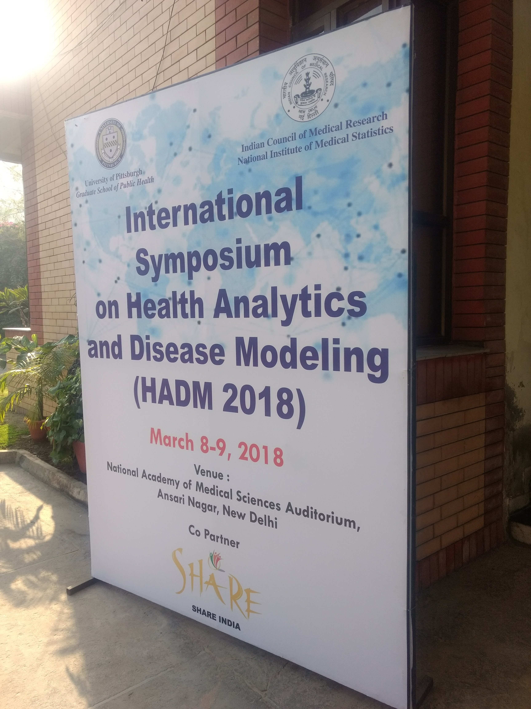
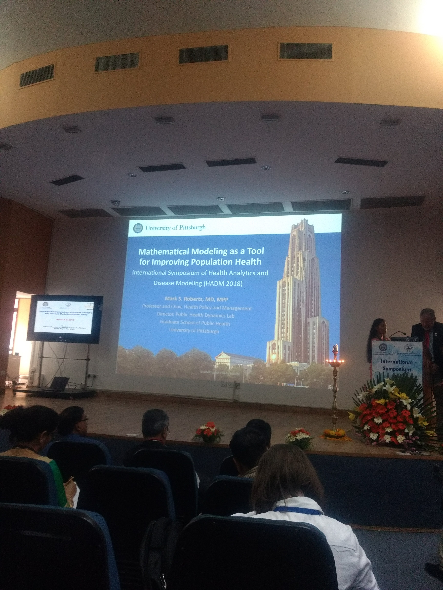

<link rel="stylesheet" type="text/css" href="../bootstrap.min.css">

  
Representing HALE Lab @ NITK, Gokul S Krishnan attended a 2-day symposium "<i>Health Analytics and Disease Modeling (HADM) 2018</i>" at the National Academy of Medical Sciences, AIMS, New Delhi, India. The event was held jointly by National Institute of Medical Statistics (NIMS) - Indian Council of Medical Research (ICMR) and Public Health Dynamics Laboratory, University of Pittsburgh, USA.

  
The talk covered various topics on Healthcare Informatics and Population Health. Speakers included Directors and other senior officials from NIMS, ICMR and NCDIR Bengaluru and also prominent researchers in the domain from University of Pittsburgh.

  
  <h3>Images</h3>
  

    

      

        <a href="../images/hadm2018/hadm2.jpg" target="_blank">
          
          

            

          

        </a>
      

    

    

      

        <a href="../images/hadm2018/hadm3.jpg" target="_blank">
          
          

            

          

        </a>
      

    

  

  

    

      

        <a href="../images/hadm2018/hadm1.jpg" target="_blank">
          
          

          

        </a>
      

    

    

      

        <a href="../images/hadm2018/hadm4.jpg" target="_blank">
          
          

            

          

        </a>
      

    

  

