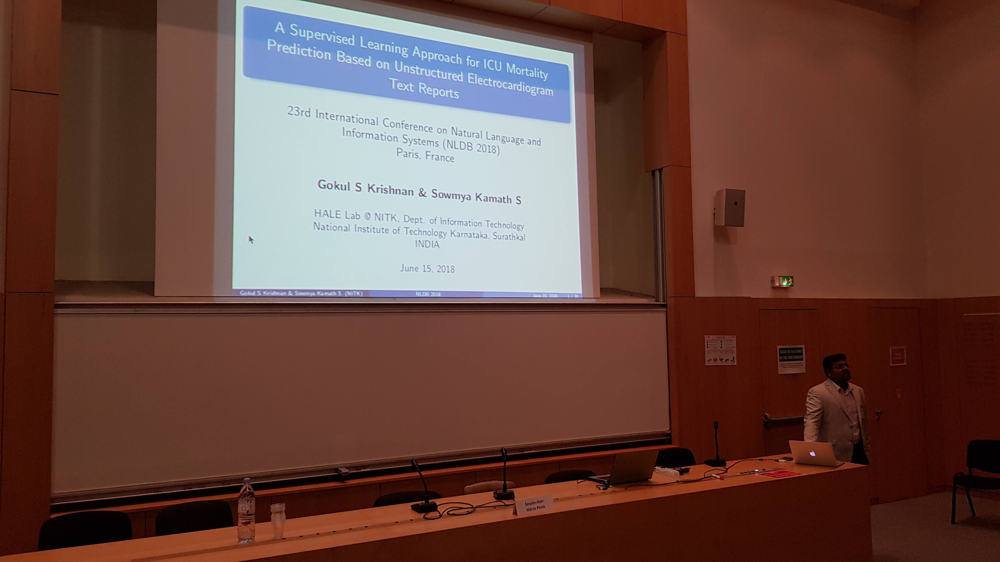
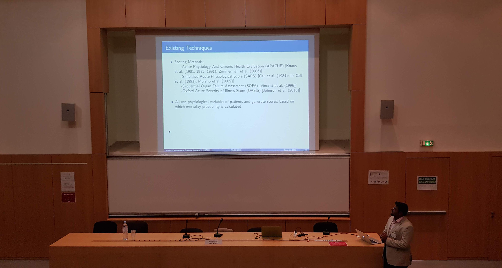

<link rel="stylesheet" type="text/css" href="../bootstrap.min.css">

  
We presented our paper titled “A Supervised Learning Approach for ICU Mortality Prediction Based on Unstructured Electrocardiogram Text Reports” in the 23rd International Conference on Natural Language and Information Systems (NLDB 2018) at Paris, France on 15th June 2018. The presentation was done by HALE Lab @ NITK Research Scholar, Gokul S Krishnan.

  <h3>Images</h3>
  

    

      

        <a href="../images/nldb2018/nldb2.jpg" target="_blank">
          
          

            

          

        </a>
      

    

    

      

        <a href="../images/nldb2018/nldb3.jpg" target="_blank">
          
          

          

        </a>
      

    

  

