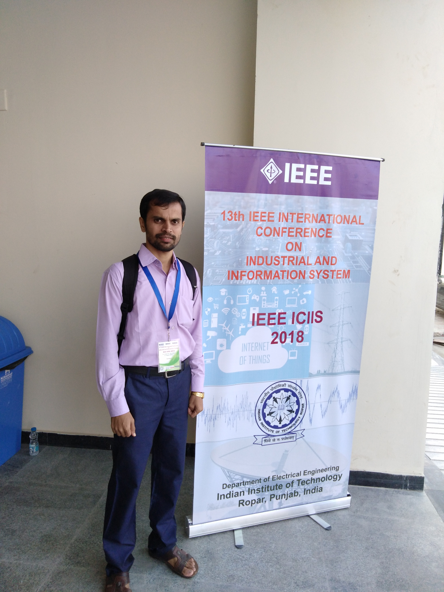
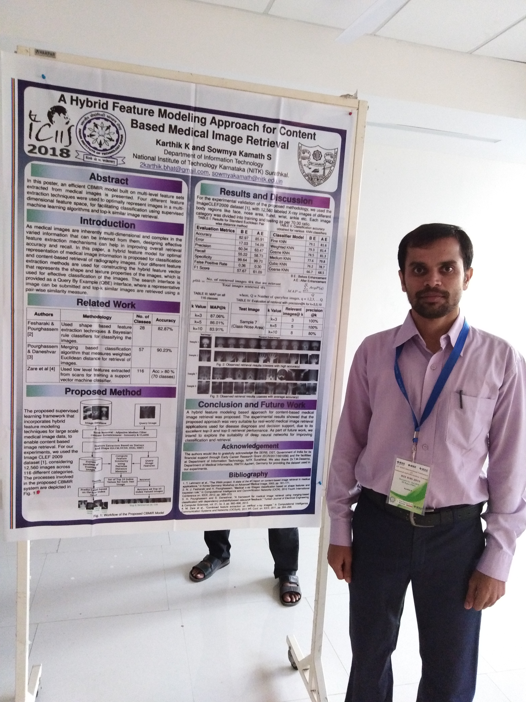

<link rel="stylesheet" type="text/css" href="../bootstrap.min.css">

  
We presented our paper titled "<a href="#" target="_blank"><i>A Hybrid Feature Modeling Approach for Content-Based Medical Image Retrieval</i></a>", authored by Karthik K &amp; Dr. Sowmya Kamath S, in the 13th IEEE International Conference on Industrial and Information Systems (ICIIS 2018) at  IIT Ropar, Punjab, India on Dec 2018. The poster presentation was done by HALE Lab @ NITK Research Scholar, Karthik K.

  <h3>Images</h3>
  
 <!-- Row -->
    

      

        <a href="../images/iciis2018/1.jpg" target="_blank">
          
          

            

          

        </a>
      

    
 <!-- End Row -->
    

      

        <a href="../images/iciis2018/2.jpg" target="_blank">
          
          

            

          

        </a>
      

    

  

