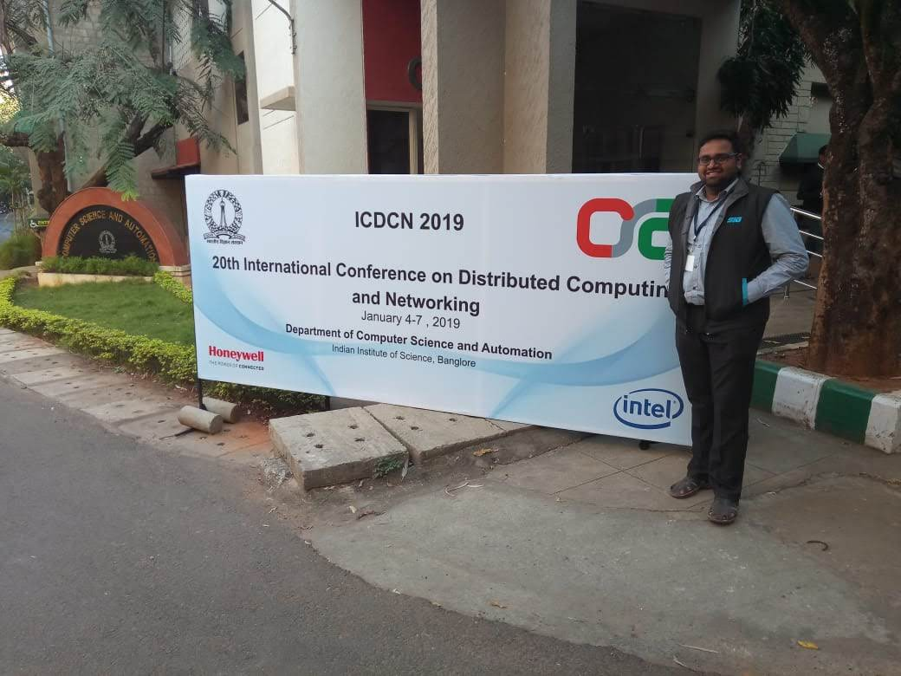
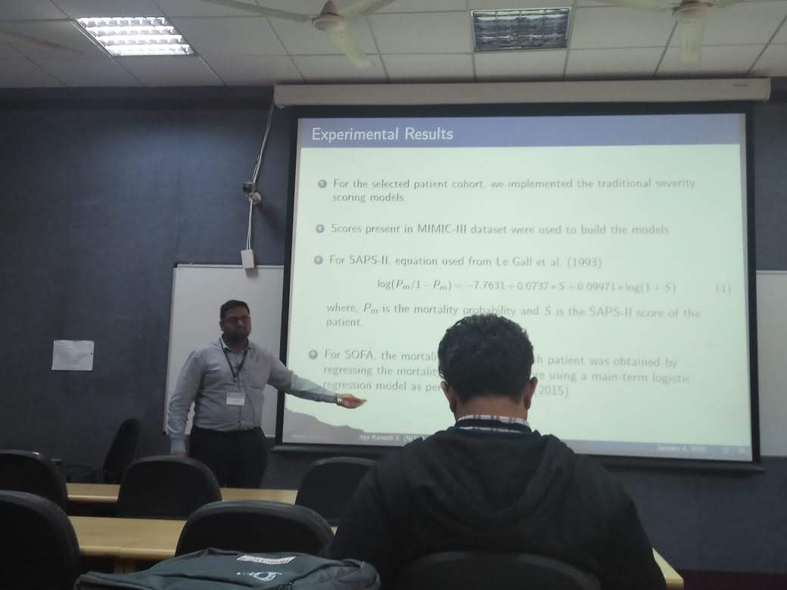

<link rel="stylesheet" type="text/css" href="../bootstrap.min.css">

  
We presented our paper titled "<a href="#" target="_blank"><i>Evaluating the Quality of Word Representation Models for Unstructured Clinical Text based ICU Mortality Prediction</i></a>", authored by Gokul S Krishnan &amp; Dr. Sowmya Kamath S, at the Cloud based Health Informatics (CHIN 2019) colocated with the 20th International Conference on Distributed Computing and Networking (ICDCN '19) at IISc Bangalore, Karnataka, India on 4th January 2019. The presentation was done by HALE Lab @ NITK Research Scholar, Gokul S Krishnan.

  <h3>Images</h3>
  
 <!-- Row -->
    

      

        <a href="../images/icdcn2019/1.jpg" target="_blank">
          
          

            

          

        </a>
      

    
 <!-- End Row -->
    

      

        <a href="../images/icdcn2019/2.jpg" target="_blank">
          
          

            

          

        </a>
      

    

  

